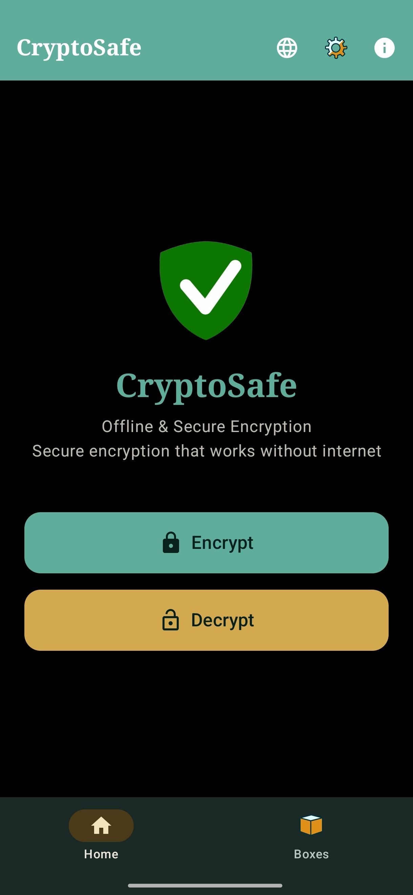
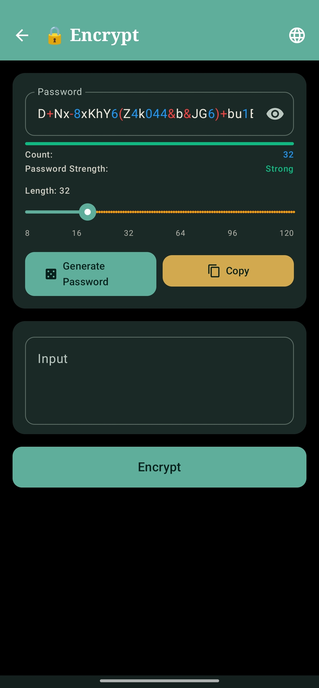
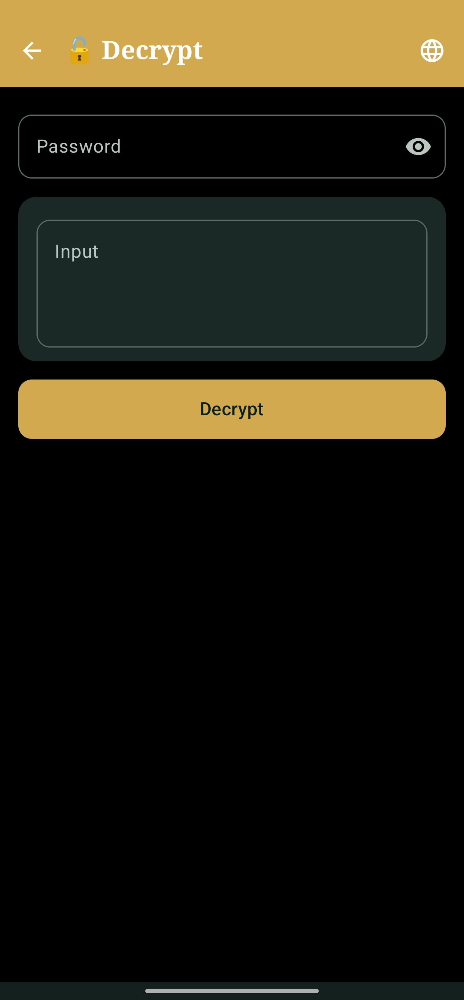
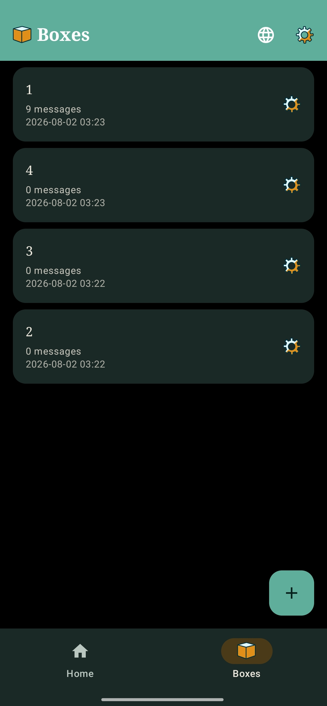
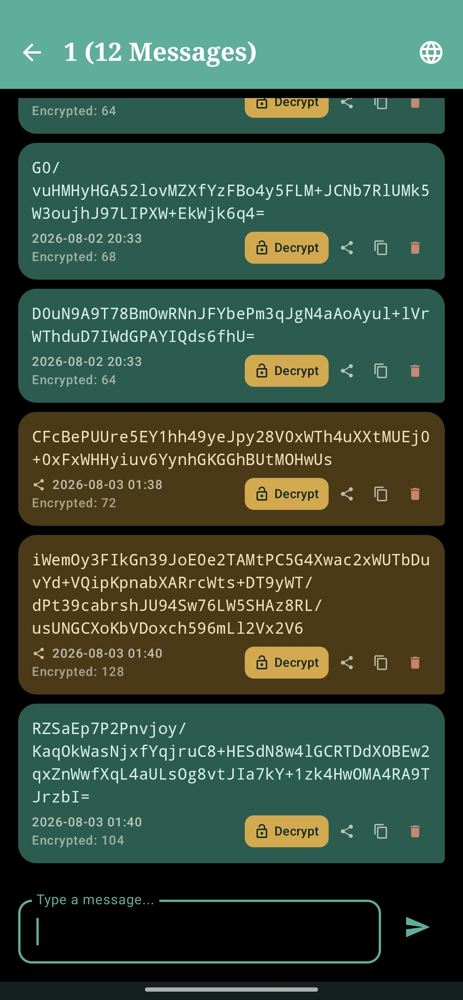
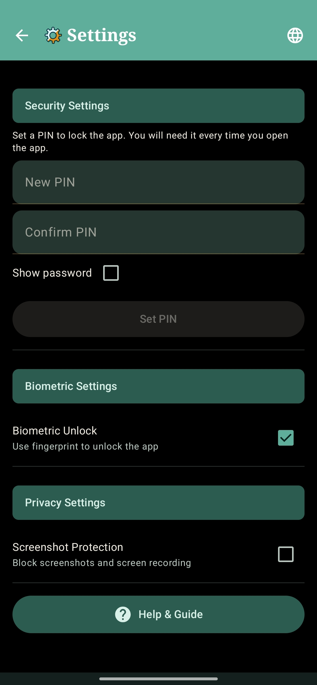

# CryptoSafe

Your support means a lot! If you find CryptoSafe useful, please:

<p align="left">
  
  &nbsp;&nbsp;&nbsp;&nbsp;&nbsp;&nbsp;
  
  <br>
	
  <b>BTC:</b> <code>bc1qwvywjftxp9v984d5leqezq2e5kyqkkk5dw2wz9</code>
  <br>
  
  <b>LTC:</b> <code>ltc1qjdql8jfhs7prt44a9thgh7rvmmm0jnx8cumd7a</code>
</p>

<br>

---

# *A lightweight, offline-first Android app for military-grade text encryption.*

<a href="https://f-droid.org/packages/com.cryptosafe.app"></a>&nbsp;&nbsp;<a href="https://apps.obtainium.imranr.dev/redirect?r=obtainium://app/%7B%22id%22%3A%22com.cryptosafe.app%22%2C%22url%22%3A%22https%3A%2F%2Fgithub.com%2FnemoXdev%2FCryptoSafe%22%2C%22author%22%3A%22nemoXdev%22%2C%22name%22%3A%22CryptoSafe%22%2C%22preferredApkIndex%22%3A0%2C%22additionalSettings%22%3A%22%7B%5C%22includePrereleases%5C%22%3Afalse%2C%5C%22fallbackToOlderReleases%5C%22%3Atrue%2C%5C%22filterReleaseTitlesByRegEx%5C%22%3A%5C%22%5C%22%2C%5C%22filterReleaseNotesByRegEx%5C%22%3A%5C%22%5C%22%2C%5C%22verifyLatestTag%5C%22%3Afalse%2C%5C%22sortMethodChoice%5C%22%3A%5C%22date%5C%22%2C%5C%22useLatestAssetDateAsReleaseDate%5C%22%3Afalse%2C%5C%22releaseTitleAsVersion%5C%22%3Afalse%2C%5C%22trackOnly%5C%22%3Afalse%2C%5C%22versionExtractionRegEx%5C%22%3A%5C%22%5C%22%2C%5C%22matchGroupToUse%5C%22%3A%5C%22%5C%22%2C%5C%22versionDetection%5C%22%3Atrue%2C%5C%22releaseDateAsVersion%5C%22%3Afalse%2C%5C%22useVersionCodeAsOSVersion%5C%22%3Afalse%2C%5C%22apkFilterRegEx%5C%22%3A%5C%22%5C%22%2C%5C%22invertAPKFilter%5C%22%3Afalse%2C%5C%22autoApkFilterByArch%5C%22%3Atrue%2C%5C%22appName%5C%22%3A%5C%22%5C%22%2C%5C%22appAuthor%5C%22%3A%5C%22%5C%22%2C%5C%22shizukuPretendToBeGooglePlay%5C%22%3Afalse%2C%5C%22allowInsecure%5C%22%3Afalse%2C%5C%22exemptFromBackgroundUpdates%5C%22%3Afalse%2C%5C%22skipUpdateNotifications%5C%22%3Afalse%2C%5C%22about%5C%22%3A%5C%22%5C%22%2C%5C%22refreshBeforeDownload%5C%22%3Afalse%2C%5C%22includeZips%5C%22%3Afalse%2C%5C%22zippedApkFilterRegEx%5C%22%3A%5C%22%5C%22%2C%5C%22includeTarballs%5C%22%3Afalse%2C%5C%22tarballedApkFilterRegEx%5C%22%3A%5C%22%5C%22%7D%22%2C%22overrideSource%22%3Anull%7D"></a>&nbsp;&nbsp;<a href="https://www.openapk.net/cryptosafe/com.cryptosafe.app/"></a>


<div align="left">
  
</div>

<br>

<table>
  <tr>
    <td align="center"></td>
    <td align="center"></td>
    <td align="center"></td>
  </tr>
  <tr>
    <td align="center"></td>
    <td align="center"></td>
    <td align="center"></td>
  </tr>
</table>


[](https://github.com/nemoXdev/CryptoSafe/releases)
[](LICENSE)
[](https://android.com)
[](https://kotlinlang.org)
[](https://developer.android.com/jetpack/compose)

---

## 📖 Table of Contents
- [✨ Features](#-features)
- [🛠️ Tech Stack](#️-tech-stack)
- [🚀 How to Build](#-how-to-build)
- [📦 Download](#-download)
- [🔒 Security & Privacy](#-security--privacy)
- [📄 License](#-license)
- [👨‍💻 Developer](#dev-section)

---

## ✨ Features

| Feature | Description |
|--------|-------------|
| 🔒 *Strong Encryption* | AES‑256‑GCM with **Argon2id** key derivation. |
| 📴 *100% Offline* | No internet permission. Your data never leaves your device. |
| 👁️ *Screenshot Blocked* | Prevents accidental leaks via screenshots or screen recording. |
| 🔐 *PIN Lock* | Custom PIN (4–32 characters) with brute-force protection (5 attempts → 30s lockout). |
| 👆 *Biometric Unlock* | Fingerprint authentication via Android BiometricPrompt API. |
| 🗄️ *Encrypted Database* | Room + SQLCipher for encrypted local storage of boxes and messages. |
| 📦 *Anonymous Boxes* | Encrypted chat boxes with individual passwords for organized conversations. |
| 💬 *Chat System* | End-to-end encrypted messaging inside each box with decrypt-on-demand. |
| 📤 *Share Intent* | Receive text shared from WhatsApp, Telegram, and other apps for quick encrypt, decrypt, or storing in a box. |
| 🔄 *Lock Modes* | Per-box password modes: ask every time, remember for a set time, remember for the session, or remember permanently (stored encrypted). |
| 🔑 *Change Password* | Re-encrypt all messages when changing a box password with per-message error handling. |
| 🧹 *Auto-Delete* | Messages auto-deleted after 1h, 6h, 12h, 1d, 7d, 30d, or 90d. |
| 🔢 *Character Counter* | Real-time character count for input and output fields and in chat messages. |
| 🔑 *Password Generator* | Generate strong random passwords with customizable length. |
| 📋 *Copy & Clear* | One‑tap copy to clipboard and quick clear of sensitive fields. |
| ❓ *Help & Guide* | Step-by-step guide for all features, available from the settings screen. |
| 🌓 *Modern UI* | Sleek Material 3 design with dark theme. |
| 🌐 *15 Languages* | English, العربية, Français, Español, Deutsch, 简体中文, Português, فارسی, کوردی, हिन्दी, Русский, 日本語, 한국어, Bahasa Indonesia, Türkçe. |

---

## 🛠️ Tech Stack

- **Language**: Kotlin 2.1.0
- **UI Toolkit**: Jetpack Compose (Material 3)
- **Build System**: Gradle 8.13 (KTS)
- **CI/CD**: GitHub Actions
- **Key Derivation**: Argon2id (argon2kt)
- **Database**: Room + SQLCipher (encrypted SQLite)
- **Secure Storage**: EncryptedSharedPreferences + Android Keystore
- **Biometric**: AndroidX Biometric API
- **Background Work**: WorkManager (auto-delete messages)
- **Min SDK**: Android 7.0 (API 24)
- **Target SDK**: Android 15 (API 35)

---

## 🚀 How to Build

### Local Build
```bash
git clone https://github.com/nemoXdev/CryptoSafe.git
cd CryptoSafe
./gradlew assembleRelease
```
The APK will be located at `app/build/outputs/apk/release/`.

*Note: Release builds require a keystore and passwords (set via `CRYPTOSAFE_STORE_PASSWORD` / `CRYPTOSAFE_KEY_PASSWORD` env vars or in `local.properties`); use `assembleDebug` for testing.*

---

## 📦 Download
<a href="https://f-droid.org/packages/com.cryptosafe.app"></a>&nbsp;&nbsp;<a href="https://apps.obtainium.imranr.dev/redirect?r=obtainium://app/%7B%22id%22%3A%22com.cryptosafe.app%22%2C%22url%22%3A%22https%3A%2F%2Fgithub.com%2FnemoXdev%2FCryptoSafe%22%2C%22author%22%3A%22nemoXdev%22%2C%22name%22%3A%22CryptoSafe%22%2C%22preferredApkIndex%22%3A0%2C%22additionalSettings%22%3A%22%7B%5C%22includePrereleases%5C%22%3Afalse%2C%5C%22fallbackToOlderReleases%5C%22%3Atrue%2C%5C%22filterReleaseTitlesByRegEx%5C%22%3A%5C%22%5C%22%2C%5C%22filterReleaseNotesByRegEx%5C%22%3A%5C%22%5C%22%2C%5C%22verifyLatestTag%5C%22%3Afalse%2C%5C%22sortMethodChoice%5C%22%3A%5C%22date%5C%22%2C%5C%22useLatestAssetDateAsReleaseDate%5C%22%3Afalse%2C%5C%22releaseTitleAsVersion%5C%22%3Afalse%2C%5C%22trackOnly%5C%22%3Afalse%2C%5C%22versionExtractionRegEx%5C%22%3A%5C%22%5C%22%2C%5C%22matchGroupToUse%5C%22%3A%5C%22%5C%22%2C%5C%22versionDetection%5C%22%3Atrue%2C%5C%22releaseDateAsVersion%5C%22%3Afalse%2C%5C%22useVersionCodeAsOSVersion%5C%22%3Afalse%2C%5C%22apkFilterRegEx%5C%22%3A%5C%22%5C%22%2C%5C%22invertAPKFilter%5C%22%3Afalse%2C%5C%22autoApkFilterByArch%5C%22%3Atrue%2C%5C%22appName%5C%22%3A%5C%22%5C%22%2C%5C%22appAuthor%5C%22%3A%5C%22%5C%22%2C%5C%22shizukuPretendToBeGooglePlay%5C%22%3Afalse%2C%5C%22allowInsecure%5C%22%3Afalse%2C%5C%22exemptFromBackgroundUpdates%5C%22%3Afalse%2C%5C%22skipUpdateNotifications%5C%22%3Afalse%2C%5C%22about%5C%22%3A%5C%22%5C%22%2C%5C%22refreshBeforeDownload%5C%22%3Afalse%2C%5C%22includeZips%5C%22%3Afalse%2C%5C%22zippedApkFilterRegEx%5C%22%3A%5C%22%5C%22%2C%5C%22includeTarballs%5C%22%3Afalse%2C%5C%22tarballedApkFilterRegEx%5C%22%3A%5C%22%5C%22%7D%22%2C%22overrideSource%22%3Anull%7D"></a>&nbsp;&nbsp;<a href="https://www.openapk.net/cryptosafe/com.cryptosafe.app/"></a>


You can download CryptoSafe from [F-Droid](https://f-droid.org/packages/com.cryptosafe.app) or from the [Releases](https://github.com/nemoXdev/CryptoSafe/releases) section in this repository.

PGP Signature Verification

The APK checksums are signed with my PGP key, which is available on public keyservers:
```
gpg --keyserver hkps://keyserver.ubuntu.com --recv-keys B735DBF5C0A886A4
```
```
Fingerprint: `4BCC F36B C56D F0E0 AEB5 C758 B735 DBF5 C0A8 86A4`
Direct Contact: `nemoXdev@proton.me`
Git & APK Signing: `140950079+nemoXdev@users.noreply.github.com`
```
To verify the APK checksums, save the PGP-signed message to a file and run:
```
gpg --verify <the file>
```
Don't install any APK if the verification fails.

If the signature is valid, compare the SHA256 checksums with:
```
sha256sum <APK file>
```
Don't install the APK if the checksums don't match.

F-Droid

APKs distributed by F-Droid are signed with the F-Droid signing key, not with my PGP key.

The "AllowedAPKSigningKeys" field in the F-Droid metadata ensures that official F-Droid builds match my Android app signing certificate.
---

## 🔒 Security & Privacy

| Aspect | Implementation |
|--------|-----------------|
| Encryption Algorithm | AES‑256 in GCM mode (authenticated encryption). |
| Key Derivation | **Argon2id** (128 MiB, 4 iterations, 4 lanes), 16‑byte salt. |
| Password Handling | CharArray used and zeroed after each operation. Password state cleared from UI immediately; may persist in heap briefly due to String immutability. |
| PIN Storage | Hashed with Argon2id + salt in EncryptedSharedPreferences. |
| Data at Rest | Room + SQLCipher for encrypted local database. |
| Network | No INTERNET permission declared. |
| Backup | `android:allowBackup="false"` prevents cloud backup of app data. |
| Screenshot | FLAG_SECURE blocks screenshots and screen recording. |
| Biometric | AndroidX BiometricPrompt API for fingerprint unlock. |
| Brute-force Protection | 5 failed PIN attempts → 30 second lockout. |

*Warning: If you lose your password or PIN, encrypted data cannot be recovered. Keep backups of both encrypted text and passwords in a safe place.*

*See the in-app Help & Guide → "Rooted Devices & Data Security" for the full threat model.*

---

## 📄 License

This project is licensed under the MIT License – see the [LICENSE](LICENSE) file for details.

---

## <a id="dev-section"></a>👨‍💻 Developer

CryptoSafe is maintained by [Nemo](https://github.com/nemoXdev).

Contributions, issues, and feature requests are welcome!

---

<p align="center">
  <sub>Made with ❤️ for privacy</sub>
</p>
