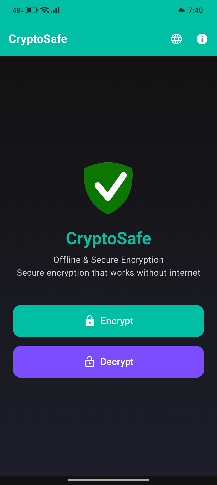

#  CryptoSafe
<div align="left">
  
  <br><br>
  
</div>

*A lightweight, offline-first Android app for military-grade text encryption.*

[](https://github.com/nemoXdev/CryptoSafe/releases)
[](LICENSE)
[](https://android.com)
[](https://kotlinlang.org)
[](https://developer.android.com/jetpack/compose)

---

## 📖 Table of Contents
- [✨ Features](#-features)
- [🛠️ Tech Stack](#️-tech-stack)
- [🚀 How to Build](#-how-to-build)
- [📦 Download](#-download)
- [🔒 Security & Privacy](#-security--privacy)
- [📄 License](#-license)
- [👨‍💻 Developer](#dev-section)

---

## ✨ Features

| Feature | Description |
|--------|-------------|
| 🔒 *Strong Encryption* | AES‑256‑GCM with **Argon2id** key derivation. |
| 📴 *100% Offline* | No internet permission. Your data never leaves your device. |
| 👁️ *Screenshot Blocked* | Prevents accidental leaks via screenshots or screen recording. |
| 🧹 *Zero Storage* | No logs, no cache, no database. Inputs wiped from memory immediately. |
| 🌓 *Modern UI* | Sleek Material 3 design with dark theme and smooth animations. |
| 🌐 *15 Languages* | English, العربية, Français, Español, Deutsch, 简体中文, Português, فارسی, کوردی, हिन्दी, Русский, 日本語, 한국어, Bahasa Indonesia, Türkçe. |
| 📋 *Copy & Clear* | One‑tap copy to clipboard and quick clear of sensitive fields. |
| 🔑 *Password Generator* | Generate strong random passwords with customizable length. |

---

## 🛠️ Tech Stack

- **Language**: Kotlin 2.1.0
- **UI Toolkit**: Jetpack Compose (Material 3)
- **Build System**: Gradle 8.13 (KTS)
- **CI/CD**: GitHub Actions
- **Key Derivation**: Argon2id (argon2kt)
- **Min SDK**: Android 7.0 (API 24)
- **Target SDK**: Android 15 (API 35)

---

## 🚀 How to Build

### Local Build
```bash
git clone https://github.com/nemoXdev/CryptoSafe.git
cd CryptoSafe
./gradlew assembleRelease
```
The APK will be located at `app/build/outputs/apk/release/`.

*Note: Release builds require a keystore; use `assembleDebug` for testing.*

---

## 📦 Download
<a href="https://f-droid.org/packages/com.cryptosafe.app">
	
</a>

You can download CryptoSafe from [F-Droid](https://f-droid.org/packages/com.cryptosafe.app) or from the [Releases](https://github.com/nemoXdev/CryptoSafe/releases) section in this repository.

PGP Signature Verification

The APK checksums are signed with my PGP key, which is available on public keyservers:
```
gpg --keyserver hkps://keyserver.ubuntu.com --recv-keys B735DBF5C0A886A4
```
```
Fingerprint: "4BCC F36B C56D F0E0 AEB5 C758 B735 DBF5 C0A8 86A4"
Email: nemoXdev <140950079+nemoXdev@users.noreply.github.com>
```
To verify the APK checksums, save the PGP-signed message to a file and run:
```
gpg --verify <the file>
```
Don't install any APK if the verification fails.

If the signature is valid, compare the SHA256 checksums with:
```
sha256sum <APK file>
```
Don't install the APK if the checksums don't match.

F-Droid

APKs distributed by F-Droid are signed with the F-Droid signing key, not with my PGP key.

The "AllowedAPKSigningKeys" field in the F-Droid metadata ensures that official F-Droid builds match my Android app signing certificate.
---

## 🔒 Security & Privacy

| Aspect | Implementation |
|--------|-----------------|
| Encryption Algorithm | AES‑256 in GCM mode (authenticated encryption). |
| Key Derivation | **Argon2id** (128 MiB, 4 iterations, 4 lanes), 16‑byte salt. |
| Password Handling | CharArray used and zeroed after each operation. Password state cleared from UI immediately; may persist in heap briefly due to String immutability. |
| Data at Rest | Nothing stored. All operations happen in RAM. |
| Network | No INTERNET permission declared. |
| Backup | `android:allowBackup="false"` prevents cloud backup of app data. |
| Screenshot | FLAG_SECURE blocks screenshots and screen recording. |

*Warning: If you lose your password, encrypted data cannot be recovered. Keep backups of both encrypted text and passwords in a safe place.*

---

## 📄 License

This project is licensed under the MIT License – see the [LICENSE](LICENSE) file for details.

---

## <a id="dev-section"></a>👨‍💻 Developer

CryptoSafe is maintained by [Nemo](https://github.com/nemoXdev).

Contributions, issues, and feature requests are welcome!

---

<p align="center">
  <sub>Made with ❤️ for privacy</sub>
</p>
